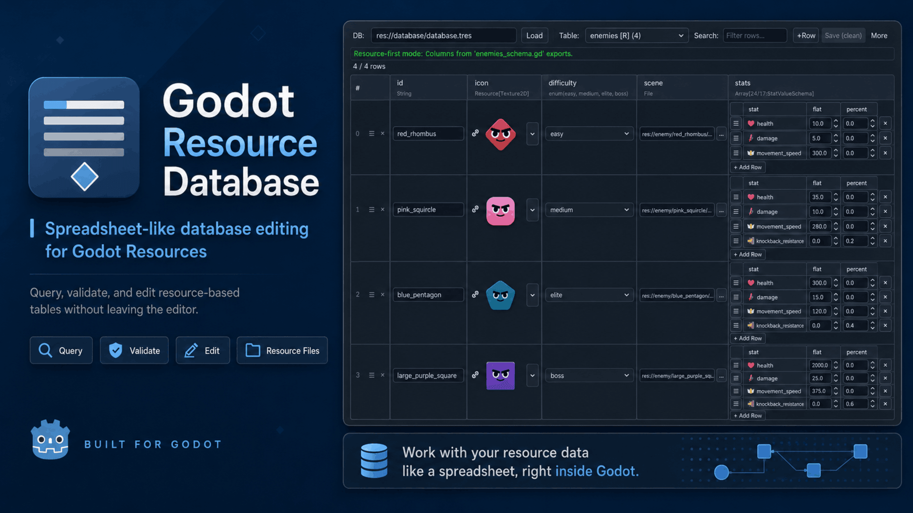

# Godot Resource Database



A Godot editor plugin for spreadsheet-like editing of `Resource`-backed data.

Use it to query, validate, and edit resource-based tables without leaving the Godot editor.

## What it does

- Edit Godot `Resource` rows in a spreadsheet-style interface.
- Define columns from typed schema resources.
- Work with nested cell resources, table references, arrays, enums, and file/resource fields.
- Generate GDScript constants for safer runtime table access.

## Installation

Copy this folder into your Godot project:

```text
addons/godot-resource-database/
```

Then enable **Godot Resource Database** in **Project > Project Settings > Plugins**.

## Documentation

See the addon README for installation details, screenshots, concepts, and API examples:

[addons/godot-resource-database/README.md](addons/godot-resource-database/README.md)
